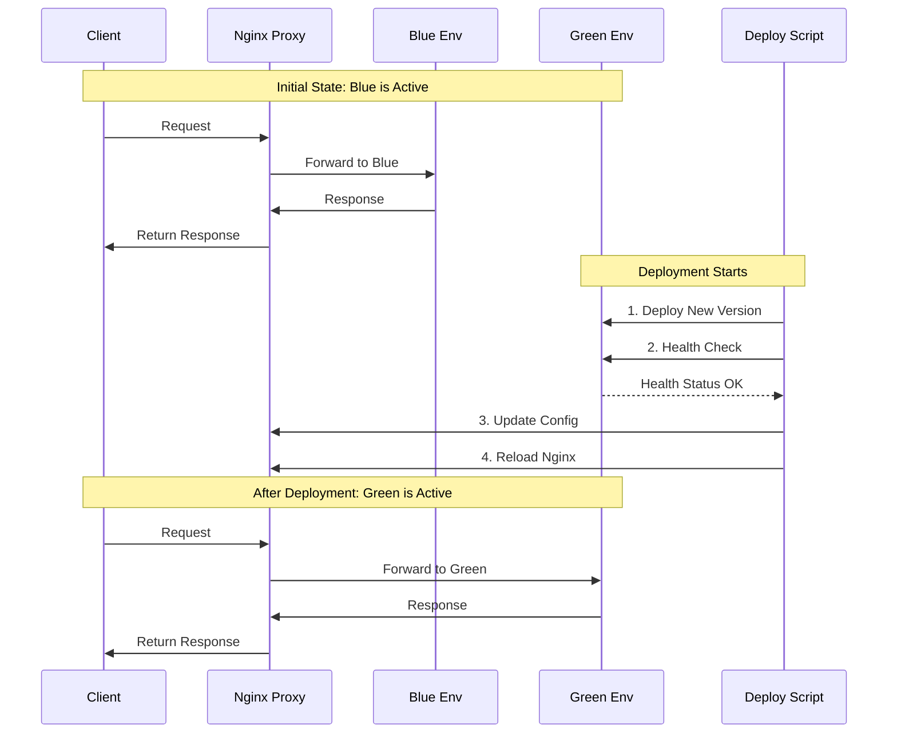
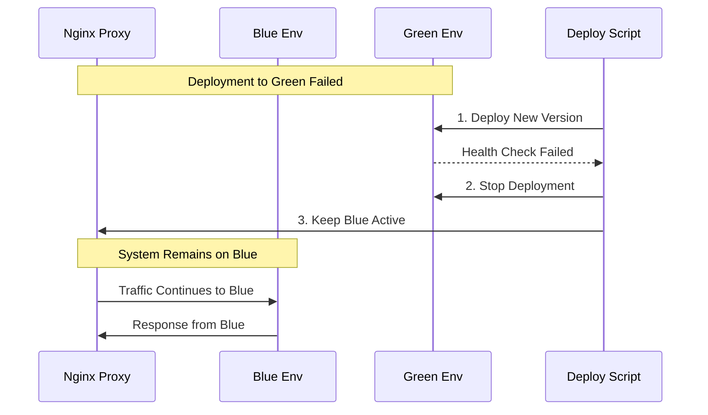

# Blue-Green Deployment Implementation

Project Page: [roadmap.sh/projects/blue-green-deployment](https://roadmap.sh/projects/blue-green-deployment)

## Table of Contents
1. [Project Overview](#project-overview)
2. [Core Concepts](#core-concepts)
3. [Implementation Details](#implementation-details)
4. [Project Requirements & Implementation](#project-requirements--implementation)
5. [Testing & Verification](#testing--verification)
6. [Directory Structure](#directory-structure)
7. [Running the Project](#running-the-project)
8. [Deployment Process](#deployment-process)
9. [Troubleshooting](#troubleshooting)

## Project Overview

This project implements a blue-green deployment strategy for a web application, enabling zero-downtime deployments with robust health checks and rollback capabilities. The implementation follows a first-principles approach, breaking down the complex deployment strategy into fundamental building blocks.

### What is Blue-Green Deployment?
Blue-green deployment is a release technique that reduces downtime and risk by running two identical production environments called Blue and Green. At any time, only one of the environments is live, serving all production traffic. The other environment remains idle.

### System Architecture
```mermaid
graph TD
    Client[Client] --> Proxy[Nginx Proxy Port 80]
    Proxy --> |Active Route| Blue[Blue Environment<br/>Port 8081]
    Proxy -.-> |Inactive Route| Green[Green Environment<br/>Port 8082]
    
    subgraph Blue Environment
        Blue --> BlueApp[Static HTML/JS App]
        Blue --> BlueHealth[/health Endpoint]
    end
    
    subgraph Green Environment
        Green --> GreenApp[Static HTML/JS App]
        Green --> GreenHealth[/health Endpoint]
    end
    
    DeployScript[Deploy Script] --> |1. Check Health| Blue
    DeployScript --> |2. Deploy New Version| Green
    DeployScript --> |3. Switch Traffic| Proxy
```

### Deployment Flow


### Rollback Process


## Core Concepts

### 1. Container Isolation
- Each environment (Blue/Green) runs in isolated containers
- Containers ensure consistent environments
- Docker provides the containerization layer

### 2. Load Balancing
- Nginx proxy routes traffic to active environment
- Dynamic configuration updates enable seamless switching
- Health checks ensure service availability

### 3. Zero-Downtime Deployment
- New version deployed to inactive environment
- Traffic switched only after health verification
- Instant rollback capability if issues arise

## Implementation Details

### 1. Environment Setup
Each environment consists of:
```yaml
version: '3.8'
services:
  web:
    image: nginx:alpine
    ports:
      - "8081:80"  # Blue
      - "8082:80"  # Green
    volumes:
      - ./html:/usr/share/nginx/html
    healthcheck:
      test: ["CMD", "curl", "-f", "http://localhost/health"]
      interval: 10s
      timeout: 5s
      retries: 3
```

### 2. Proxy Configuration
```nginx
http {
    upstream backend {
        server localhost:8081;  # Default to blue
    }

    server {
        listen 80;
        location / {
            proxy_pass http://backend;
        }
    }
}
```

### 3. Health Check Implementation
```bash
verify_health() {
    local port=$1
    local retries=30
    for i in $(seq 1 $retries); do
        if curl -s http://localhost:$port/health | grep -q "healthy"; then
            return 0
        fi
        sleep 2
    done
    return 1
}
```

## Project Requirements & Implementation

### 1. Basic Requirements 
- **Separate Containers**: Implemented using Docker Compose
  ```yaml
  # blue/docker-compose.yml & green/docker-compose.yml
  services:
    web:
      image: nginx:alpine
      container_name: ${COLOR}-web
  ```
  
- **Traffic Switching**: Implemented via Nginx proxy
  - Live Demo: http://44.203.38.191
  - Blue Environment: http://44.203.38.191:8081
  - Green Environment: http://44.203.38.191:8082

- **Health Checks**: Implemented at multiple levels
  ```json
  # Health Check Response
  {"status":"healthy"}
  ```

### 2. Zero-Downtime Deployment 
- Deployment Process:
  1. Deploy new version to inactive environment
  2. Verify health checks
  3. Switch traffic at proxy level
  4. Keep old version running for potential rollback

### 3. Logging and Monitoring 
- Deployment logs:
  ```bash
  [2025-02-18 10:28:20] Starting deployment to green environment
  [2025-02-18 10:28:25] Health check passed
  [2025-02-18 10:28:26] Successfully switched traffic
  ```

## Testing & Verification

### 1. Health Check Testing
```bash
# Test blue environment
curl http://localhost:8081/health
# Expected: {"status":"healthy"}

# Test green environment
curl http://localhost:8082/health
# Expected: {"status":"healthy"}
```

### 2. Deployment Verification
```bash
# Before deployment
curl http://localhost  # Shows Blue version

# After deployment
curl http://localhost  # Shows Green version
```

### 3. Rollback Testing
```bash
# Simulate failure
docker stop green-web

# Automatic rollback
# Proxy remains on blue environment
curl http://localhost  # Still shows Blue version
```

## Directory Structure
```
.
├── blue/                  # Blue environment
│   ├── docker-compose.yml
│   └── html/
│       └── index.html
├── green/                 # Green environment
│   ├── docker-compose.yml
│   └── html/
│       └── index.html
├── proxy/                 # Main proxy
│   ├── docker-compose.yml
│   └── nginx.conf
├── nginx/                 # Shared config
│   └── default.conf
└── deploy.sh             # Deployment script
```

## Running the Project

### 1. Initial Setup
```bash
# Start blue environment
cd blue && docker-compose up -d

# Start proxy
cd ../proxy && docker-compose up -d
```

### 2. Deployment
```bash
# Deploy new version
./deploy.sh
```

### 3. Verification
```bash
# Check active environment
curl http://localhost

# Check both environments
curl http://localhost:8081
curl http://localhost:8082
```

## Deployment Process

### 1. Pre-deployment Checks
- Verify current active environment
- Check system resources
- Validate new version

### 2. Deployment Steps
```bash
# 1. Identify target environment
CURRENT_ENV=$(cat .active_env)
TARGET_ENV=$([ "$CURRENT_ENV" = "blue" ] && echo "green" || echo "blue")

# 2. Deploy to target
cd $TARGET_ENV && docker-compose up -d

# 3. Verify health
verify_health $TARGET_PORT

# 4. Switch traffic
sed -i "s/$CURRENT_PORT/$TARGET_PORT/" ../proxy/nginx.conf
docker exec proxy nginx -s reload
```

### 3. Post-deployment
- Monitor error rates
- Verify application metrics
- Keep old version ready for rollback

## Troubleshooting

### Common Issues
1. **Health Check Failures**
   ```bash
   # Check logs
   docker logs ${COLOR}-web
   ```

2. **Proxy Issues**
   ```bash
   # Verify nginx config
   docker exec proxy nginx -t
   ```

3. **Port Conflicts**
   ```bash
   # Check port usage
   netstat -tulpn | grep '808[1-2]'
   ```

### Recovery Steps
1. **Quick Rollback**
   ```bash
   # Switch back to previous environment
   sed -i "s/$TARGET_PORT/$CURRENT_PORT/" proxy/nginx.conf
   docker exec proxy nginx -s reload
   ```

2. **Environment Reset**
   ```bash
   # Clean restart
   docker-compose down
   docker-compose up -d
   ```

This implementation provides a robust, production-ready blue-green deployment solution with:
- Zero-downtime deployments
- Automated health checks
- Instant rollback capability
- Comprehensive logging
- Clear deployment process

Live demo available at: http://44.203.38.191
